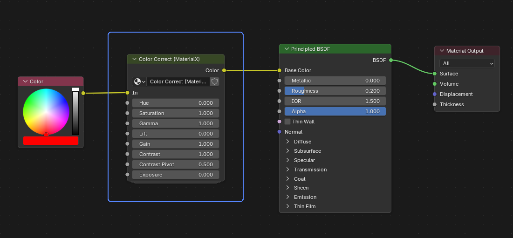
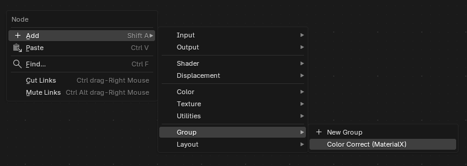

# Color Correct (MaterialX)

A Blender add-on that recreates the MaterialX `colorcorrect` compound node as a
shader Node Group, built entirely from Blender's built-in shader nodes.



Useful when authoring materials in Blender that need to match a look developed
in MaterialX-based pipelines (Houdini/Solaris, Karma, etc.), where
`colorcorrect` is a common grading node that has no direct Blender equivalent.

## Features

- Faithful recreation of `NG_colorcorrect_color3` from the MaterialX standard
  library (`stdlib_ng.mtlx`), numerically verified against the published
  formula
- Same inputs as the MaterialX node:
  `In`, `Hue`, `Saturation`, `Gamma`, `Lift`, `Gain`, `Contrast`,
  `Contrast Pivot`, `Exposure`
- Supports over-saturation (`Saturation` > 1), matching MaterialX behavior
- A single shared Node Group is created on first use and reused afterwards,
  so adding the node to many materials stays lightweight
- Works with both Cycles and EEVEE (plain shader nodes, no custom rendering
  code)

## Installation

Requires Blender 4.2 or later (this add-on is packaged as a Blender
Extension).

1. Download the latest release zip (`color_correct_materialx-*.zip`) 
2. In Blender, open `Edit > Preferences...` and go to the `Get Extensions`
   tab.
3. Click the dropdown arrow (▼) in the top-right corner of that tab and
   choose `Install from Disk...`.
4. In the file browser, select the zip file you downloaded (do not unzip
   it first) and confirm.
5. Blender installs and enables the extension automatically. You can verify
   it's active by checking that "Color Correct (MaterialX)" is listed and
   checked under `Get Extensions` (or under `Add-ons`, depending on your
   Blender version).
6. No restart is required — the node becomes available immediately in the
   Shader Editor (see Usage below).

To update to a newer version, repeat the same steps with the new zip;
Blender will replace the existing installation.

## Usage

In the Shader Editor:

```
Add > Group > Color Correct (MaterialX)
```



The node processes colors in scene-linear space, in the same order as the
MaterialX definition:

```
hue rotation -> saturation -> gamma -> lift -> gain -> contrast -> exposure
```

## Notes

- The luminance coefficients used by the saturation stage are the MaterialX
  defaults (ACEScg primaries).
- This is an independent, unofficial recreation of the node's published
  formula. It contains no code from the MaterialX project and is not
  affiliated with or endorsed by the MaterialX project or the Academy
  Software Foundation.

## Development

The extension is a single self-contained file (`__init__.py`) plus the
extension manifest. To build the distributable zip:

```
blender --command extension build --source-dir . --output-dir .
```

## Links

- More tools by the author: https://sugiggy.gumroad.com/

## License

[GPL-3.0-or-later](LICENSE)
